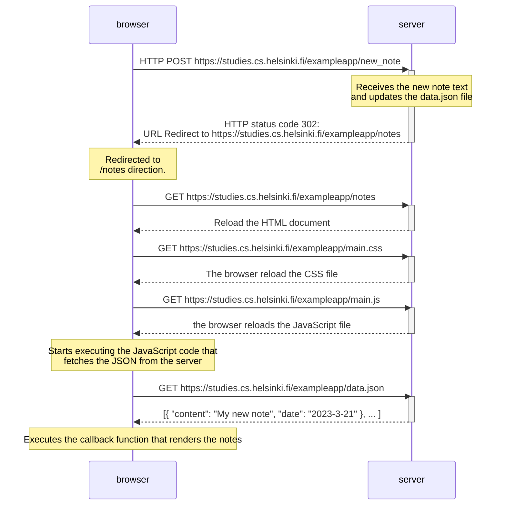

```mermaid
sequenceDiagram
    participant browser
    participant server

    browser->>+server: HTTP POST https://studies.cs.helsinki.fi/exampleapp/new_note
    Note over server: Receives the new note text <br> and updates the data.json file
    server-->>-browser: HTTP status code 302: <br> URL Redirect to https://studies.cs.helsinki.fi/exampleapp/notes
    Note over browser: Redirected to <br> /notes direction.

    browser->>+server: GET https://studies.cs.helsinki.fi/exampleapp/notes
    server-->>-browser: Reload the HTML document

    browser->>+server: GET https://studies.cs.helsinki.fi/exampleapp/main.css
    server-->>-browser: The browser reload the CSS file

    browser->>server: GET https://studies.cs.helsinki.fi/exampleapp/main.js
    activate server
    server-->>browser: the browser reloads the JavaScript file
    deactivate server

    Note over browser: Starts executing the JavaScript code that<br> fetches the JSON from the server

    browser->>server: GET https://studies.cs.helsinki.fi/exampleapp/data.json
    activate server
    server-->>browser: [{ "content": "My new note", "date": "2023-3-21" }, ... ]
    deactivate server

    Note over browser: Executes the callback function that renders the notes

```

