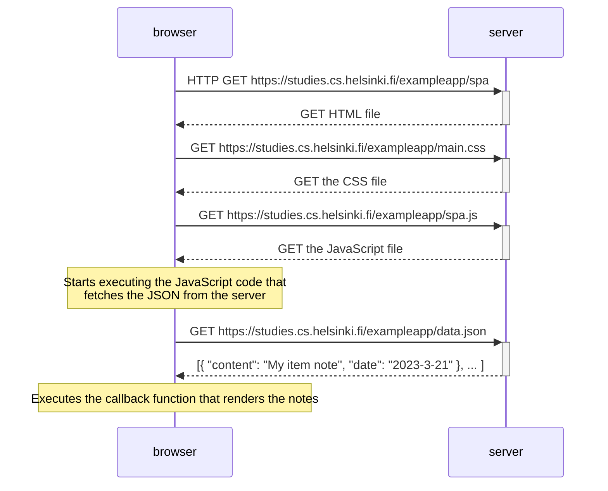

```mermaid
sequenceDiagram
    participant browser
    participant server

    browser->>+server: HTTP GET https://studies.cs.helsinki.fi/exampleapp/spa
    server-->>-browser: GET HTML file

    browser->>+server: GET https://studies.cs.helsinki.fi/exampleapp/main.css
    server-->>-browser: GET the CSS file

    browser->>+server: GET https://studies.cs.helsinki.fi/exampleapp/spa.js
    server-->>-browser: GET the JavaScript file

    Note over browser: Starts executing the JavaScript code that<br> fetches the JSON from the server

    browser->>+server: GET https://studies.cs.helsinki.fi/exampleapp/data.json
    server-->>-browser: [{ "content": "My item note", "date": "2023-3-21" }, ... ]

    Note over browser: Executes the callback function that renders the notes

```