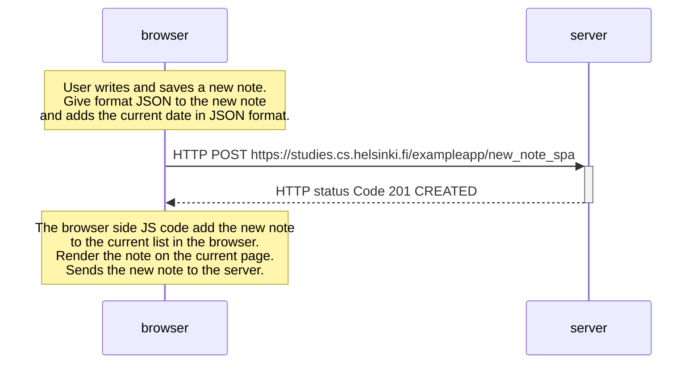

```mermaid
sequenceDiagram
    participant browser
    participant server

    Note over browser: User writes and saves a new note. <br> Give format JSON to the new note <br> and adds the current date in JSON format.
    browser->>+server: HTTP POST https://studies.cs.helsinki.fi/exampleapp/new_note_spa
    server-->>-browser: HTTP status Code 201 CREATED

    Note over browser: The browser side JS code add the new note <br> to the current list in the browser.<br> Render the note on the current page. <br> Sends the new note to the server.

```